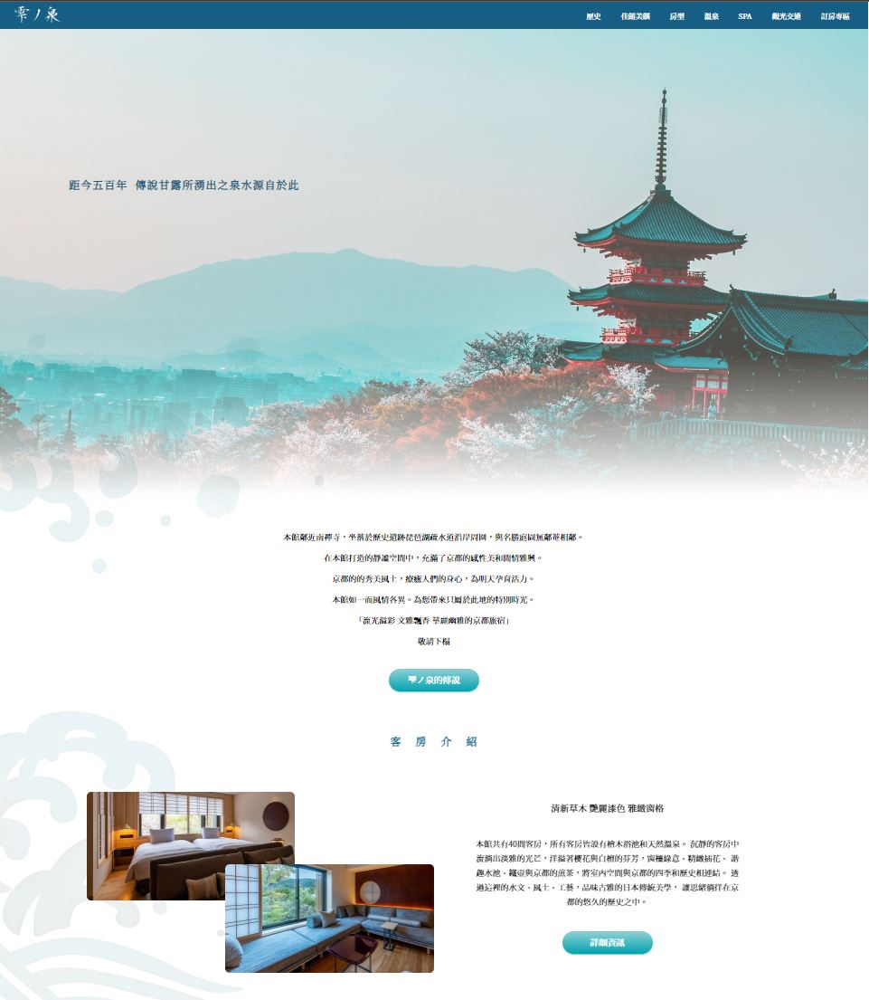
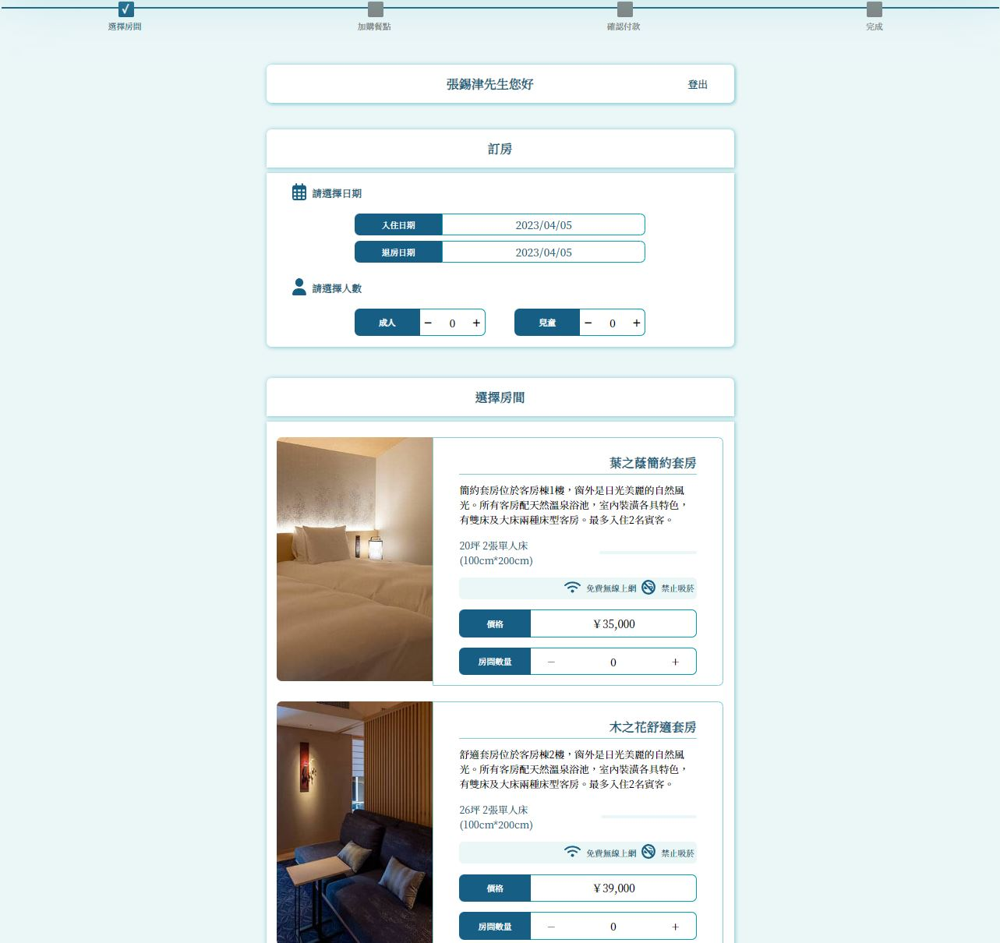
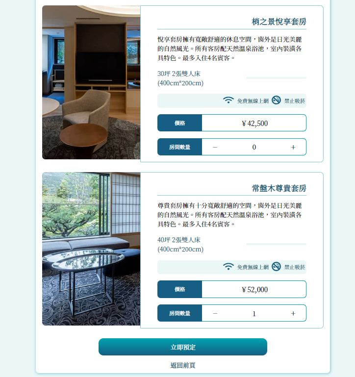
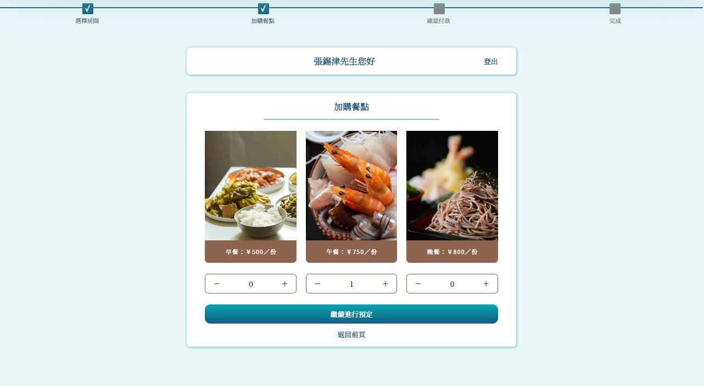
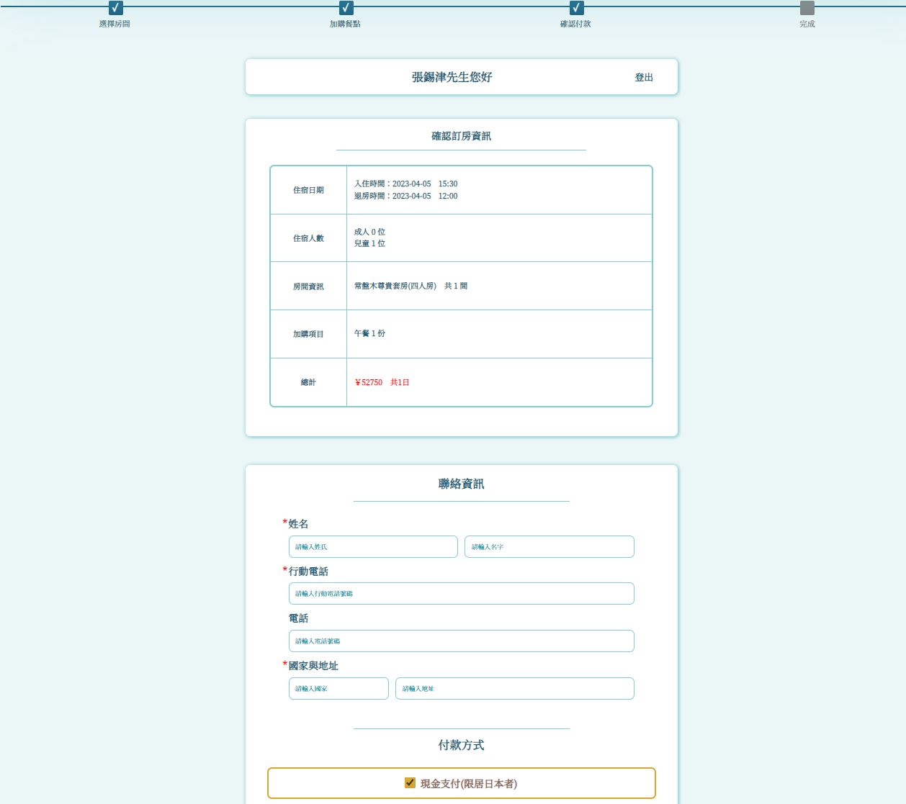
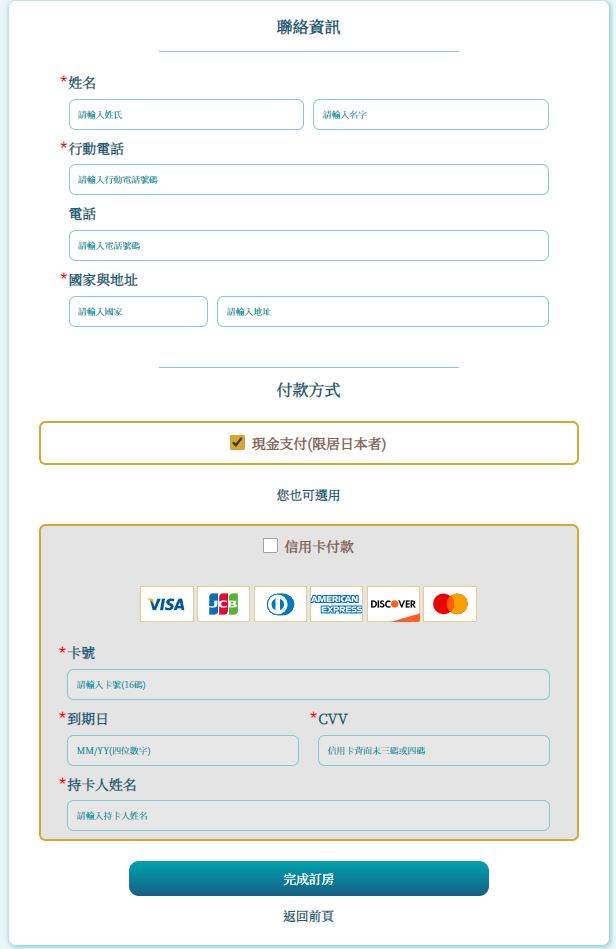
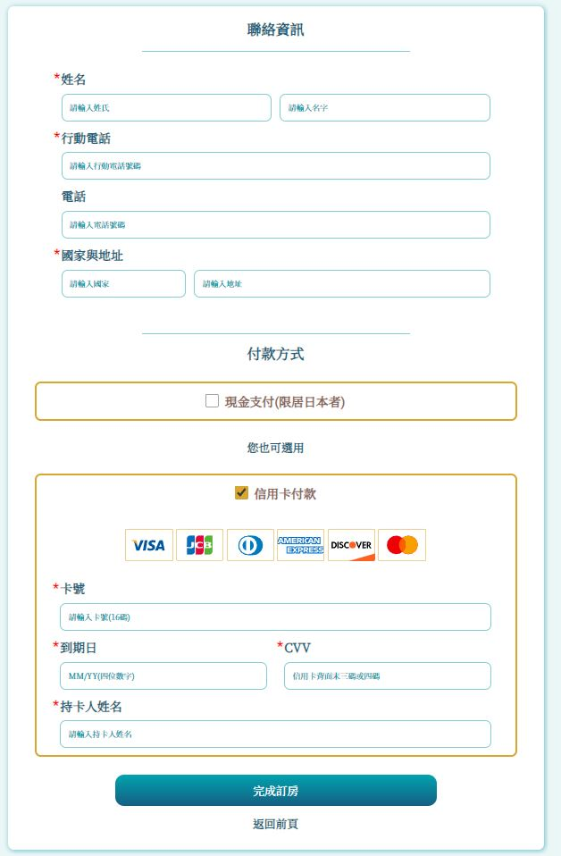
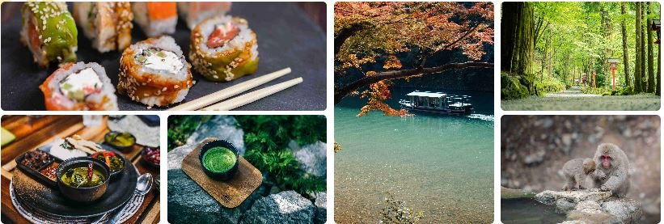
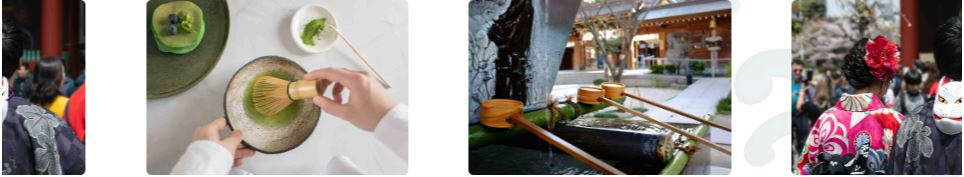
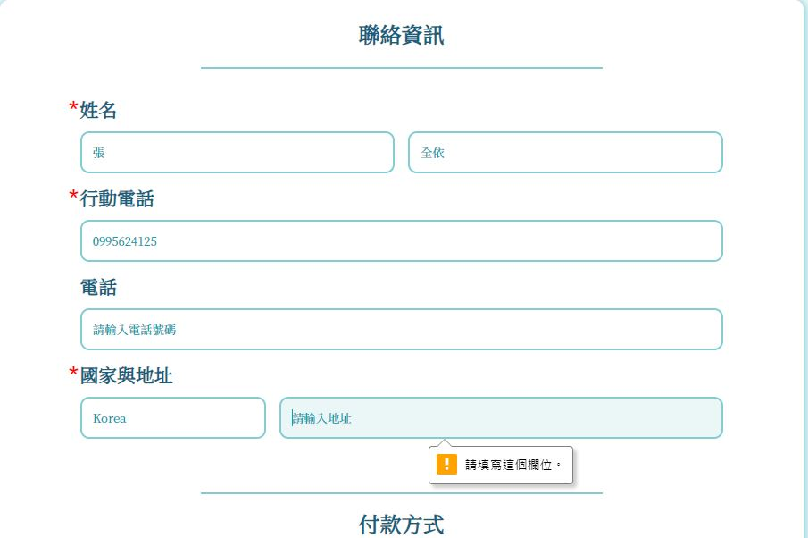

# 飯店旅館網站-雫ノ泉
### 本專案無使用任何框架，單純使用HTML、CSS、JS與SCSS所實踐而成(另有使用AOS Library輔助開發動畫效果)。

 

# 設計理念：
### 此專案為2022年11月與組員於前端培訓班一同開發。
### 經過思索過後決定選擇日式旅館當作成果發表的作業。
### 本人負責程式撰寫、切版等工作

 

# 本專案特色
### 採用日式風格建置網站。
### 

### 1.使用了Local Storage來跨頁存取資料，並模擬出訂房的步驟與流程
### 
### 
### 
### 
### 
### 
 

### 2.利用Vanilla CSS以及AOS Library做出不同的動畫效果。
### Flex 排版
### 

 

### Vanilla CSS 跑馬燈效果
### 
 

### 3.表單皆有使用Regex進行字符字串匹配。
### 
 